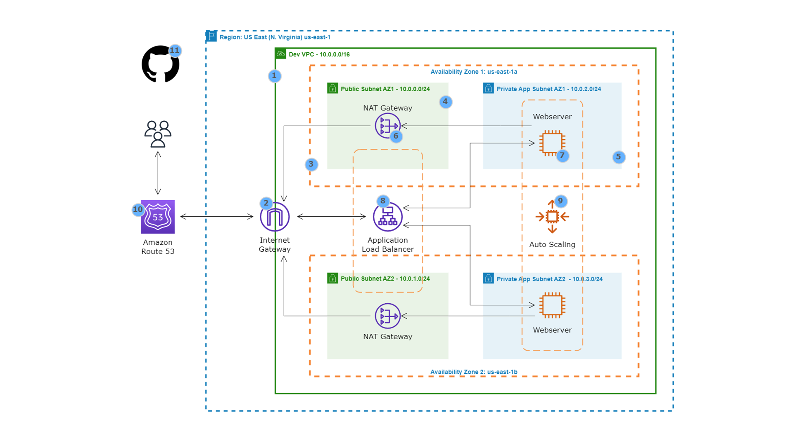

---
# Static Web App Hosting on AWS

## Project Overview
This project demonstrates how to host a static HTML web application on AWS. The architecture ensures high availability, fault tolerance, and scalability by leveraging various AWS services.

## Architecture
- **Virtual Private Cloud (VPC)**: Configured with public and private subnets across two availability zones for enhanced reliability and security.
- **Internet Gateway**: Enables communication between instances in the VPC and the internet.
- **Security Groups**: Acts as a virtual firewall for the instances.
- **NAT Gateway**: Allows instances in private subnets to access the internet while maintaining security.
- **Bastion Host**: Provides secure access to private subnets.
- **Application Load Balancer**: Distributes incoming web traffic across multiple EC2 instances in different availability zones.
- **EC2 Instances**: Hosts the web application.
- **Auto Scaling Group**: Automatically adjusts the number of EC2 instances to meet traffic demand.
- **Route 53**: Manages the domain name and DNS settings.
- **Amazon Machine Image (AMI)**: Used for creating identical EC2 instances with pre-configured settings.

## Deployment Script
Below is the bash script used to deploy the web app on an EC2 instance:

```bash
#!/bin/bash
sudo su
yum update -y
yum install -y httpd
cd /var/www/html
wget https://github.com/azeezsalu/mole-site1/raw/main/mole.zip
unzip mole.zip
cp -r /var/www/html/mole-main/* /var/www/html
rm -rf mole.zip mole-main
systemctl enable httpd
systemctl start httpd
```

## Deployment Steps
1. **VPC Setup**: Configure the VPC with public and private subnets.
2. **Security and Gateway Configuration**: Set up the Internet Gateway and Security Groups.
3. **Launch EC2 Instances**: Deploy EC2 instances within the VPC subnets.
4. **Configure Load Balancer and Auto Scaling**: Set up the Application Load Balancer and Auto Scaling Group.
5. **Domain Setup**: Register and configure the domain name with Route 53.
6. **Deploy Web App**: Use the provided script to install and start the web application on EC2 instances.
7. **AMI Creation**: After successful deployment, create an AMI from the EC2 instance.

## Repository Structure
- `Deployment Script`: Contains the script for setting up the web application on the EC2 instance.
- `Architectural Diagram`: Visual representation of the AWS architecture used.

## Additional Resources
- AWS Documentation: [EC2 User Guide](https://docs.aws.amazon.com/ec2/index.html)
- GitHub Repository for Webfiles: [azeezsalu/mole-site1](https://github.com/azeezsalu/mole-site1)

---
